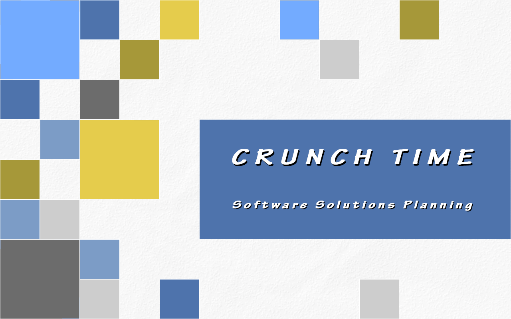

# Crunch Time

Our [entry](https://ldjam.com/events/ludum-dare/40/crunch-time) for Ludum Dare 40.

Welcome to Software Solutions Planning incorporated! As our latest hire, your job is to crank out features.

Fit your features onto the schedule, work around meetings, and leave time for other commitments.  Make sure that every new pieces of code reuses every other piece of code you wrote before, all while dealing with ever-tightening deadlines.  And when you get stuck, travel back in time to refactor your code and try again.

After all, what's the only thing more fun than crunch mode?  Going back in time to repeat crunch mode again, and again ... and again!!

